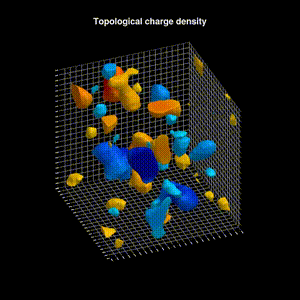

# Visualization of QCD vacuum

- 2025/01/11
- A. Tomiya akio@yukawa.kyoto-u.ac.jp 



[Another example (Youtube)](http://youtube.com/shorts/nscMhDamzfg)

# Introduction

This code set visualizes a configuration in **ILDG** format. This is written in Julia language. This contains configuration generation through [JuliaQCD](https://github.com/JuliaQCD).

The fourth lattice direction is shown as a sequence of Euclidean slices; it is not treated as real-time evolution. The sample GIF above uses the topological charge-density renderer. By default, the package renders local action-density blobs inspired by the VisualQCD / QCD Lava Lamp style. The older plaquette log iso-surface renderer is still available as a legacy mode.

# How to use

This uses [Julia](https://julialang.org/).
Please down load it from [here](https://julialang.org/downloads/).

## Install

Please install all packages in ``install_packages.jl``.
Please execute ``julia install_packages.jl`` then they are installed.

## Visualization from an existing configuration

```julia
using VisualizingLQCD
function test()
    NX = 24
    NY = 24
    NZ = 24
    NT = 32 # Euclidean fourth direction
    β = 6.0
    NC = 3

    # the number of gradient flow steps in configuration generation
    flow_steps_in = 200

    confname = "Conf$(NX)$(NY)$(NZ)$(NT)beta$(β).ildg"
    videoname = "plaquette_3D_contour_animation$(NX)$(NY)$(NZ)$(NT)beta$(β).mp4"

    @time plaq_t = heatbathtest_4D(NX, NY, NZ, NT, β, NC, flow_steps_in, confname)
    # Default: local action-density blob visualization
    create_animation(NX, NY, NZ, NT, NC, videoname; beta=β, filename=confname)
end
```

One can use a sample [configuration file](https://www.dropbox.com/scl/fi/ujkmaeszcm33gku7kl67v/Conf24242432beta6.0.ildg?rlkey=4fyzg3krxsy7azlcjgl68nvsm&dl=0) (ILDG file).

To rotate the camera during the movie, pass
`camera_motion=VisualizingLQCD.CAMERA_MOTION_ORBIT`. The bundled README GIF
uses the topological charge-density volume renderer with
`frame_mode=VisualizingLQCD.FRAME_MODE_SEQUENCE`, `nloops=4`, and
`framerate=8`, so the `32` Euclidean fourth-direction slices loop exactly four
times while the camera completes one full turn. The source movie is rendered at
`480 x 480`, the GIF is displayed at `300` px, and axis labels are hidden to
avoid label shimmer during the camera orbit.

## Visualization from scratch

1. Set parameters in ``constants.jl`` (This is a text file, size and the name of the configuration)
2. Execute ``julia configuration_generation.jl`` (it takes time)
3. Execute ``julia visualization.jl``

# Files

```
README.md : This file 
configuration_generation.jl : Configuration generation with the heatbath algorithm
constants.jl : constants are defined
header.jl : packages 
install_packages.jl : package installer
topological_density_noaxis_halfspeed.mp4 : sample topological charge-density slice-sequence orbit video
topological_density_noaxis_halfspeed.mp4.metadata.json : metadata sidecar for the sample video
topological_density_noaxis_halfspeed.gif : README GIF generated from the sample video
visualization.jl : A code for visulalization
```


# Note

- This package is inspired by [very nice visualization of QCD configurations](http://www.physics.adelaide.edu.au/theory/staff/leinweber/VisualQCD/Nobel/) by Derek B. Leinweber.
- Please mention this code set/video if you use in a presentation or paper.
- Similar package can be seen in [AnimateLQCD.jl](https://github.com/akio-tomiya/AnimateLQCD.jl).
- Pease feel free to contribute to this package.
